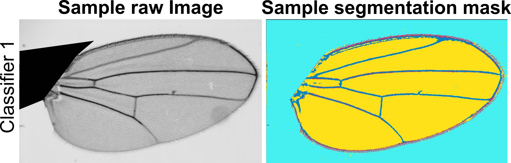
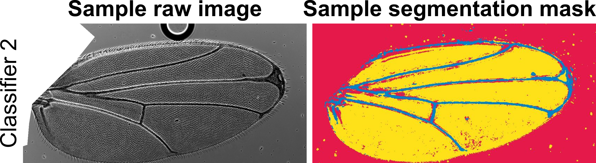
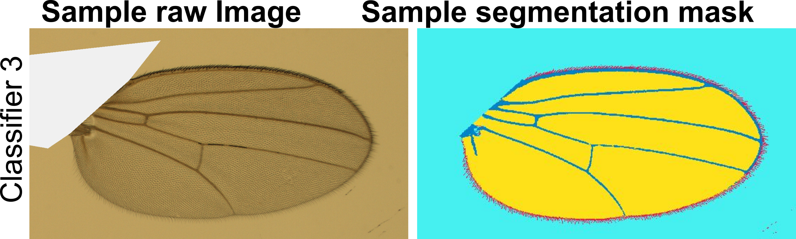
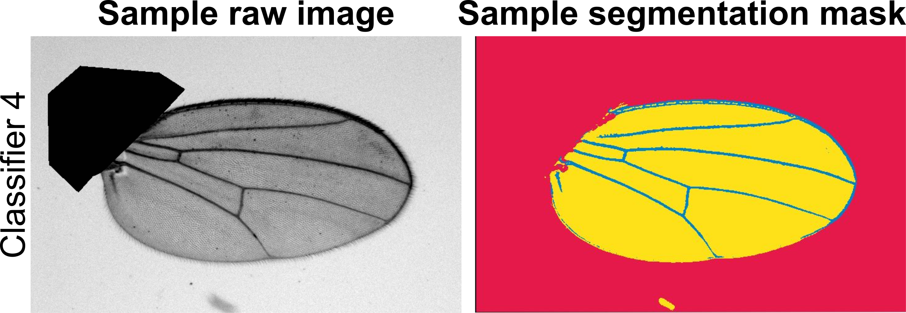
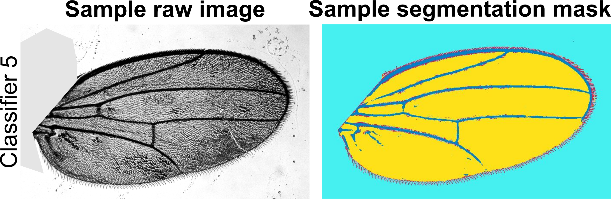
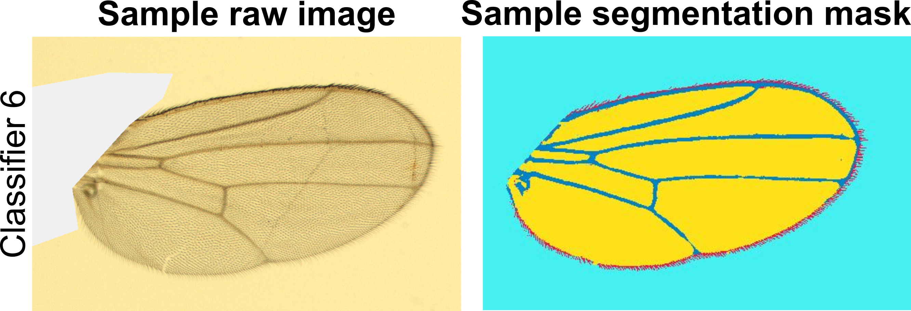

Here is a repository for the manuscript titled MAPPER: A new image analysis pipeline unmasks differential regulation of *Drosophila* wing features developed and written by Nilay Kumar in the Zartman lab at the University of Notre Dame. You can find the pre-print of the paper on bioRxiv [here](https://www.biorxiv.org/content/10.1101/2020.12.16.422888v1.full). The bulk of the code was built by [Nilay Kumar](https://scholar.google.com/citations?user=XZjD7PYAAAAJ&hl=en) and co-developed by [Francisco Huizar](https://www.linkedin.com/in/francisco-huizar-82bb1a127/), [Dr. Ramezan Paravi Torghabeh](https://www.linkedin.com/in/ramezan-paravi-torghabeh-phd-b432baa0/), and [Dr. Pavel Brodskiy](https://www.linkedin.com/in/pavelbrodskiy). Experimental work and validation was carried out by Nilay Kumar, [Dr. Maria Unger](https://www.linkedin.com/in/maria-unger-10523158), [Trent Robinett](https://www.linkedin.com/in/trent-robinett-5a8979161), [Keity J. Farfan-Pira](https://mx.linkedin.com/in/keity-j-farf%C3%A1n-pira-3a5a06209), and [Dharsan Soundarrajan](https://scholar.google.com/citations?user=AWv4OiIAAAAJ&hl=en). This work was done within the [Multicellular Systems Engineering Lab](http://sites.nd.edu/zartmanlab/) at the University of Notre Dame and the [Laboratory of Growth Biology and Morphogenesis](https://www.fisio.cinvestav.mx/academicos/nahmad/index.html) at the Center for Research and Advanced Studies of the National Polytechnical Institute (Cinvestav). Please direct any questions to the principal investigator, [Dr. Jeremiah Zartman](http://sites.nd.edu/zartmanlab/contacts/). 

All code for the MAPPER application was done using [MATLAB](https://www.mathworks.com/products/matlab.html).  

# Instructions to run the application
- You can download all of the associated code [here](https://downgit.github.io/#/home?url=https://github.com/fjhuizar/MAPPER/tree/main/MAPPER_v1.0.0)
- Once you have downloaded the .ZIP folder, extract the folder to an easily accessible location
- You can download the full user manual for how to begin using MAPPER [here](https://github.com/fjhuizar/MAPPER/raw/main/MAPPER_v1.0.0/MAPPER_manual.pdf)
  - Alternatively, the full user manual is available within the downloadable MAPPER folder

# Available [ILASTIK](https://www.ilastik.org/documentation/pixelclassification/pixelclassification.html) pixel classification modules
Below you will find pre-trained pixel classification modules in ILASTIK for several wing images we have already processed. These modules are crucial for step five of the MAPPER user manual. Below each module link, you will find a representative image of the *Drosophila* wings that were used to train the module. You should download and use the ILASTIK module that has the closest resemblance in lighting, background, brightness, contrast, and saturation to the images you would like to process. If none of the available ILASTIK modules closely resemble the images you would like to process, there are detailed instructions in the user manual on how to train your own ILASTIK module. **NOTE:** The number of channels of your images must match the number of channels in the training data for the ILASTIK module you choose (*i.e.,* RGB channel images must have an ILASTIK module trained on RGB channel images).

- [Download](https://downgit.github.io/#/home?url=https://github.com/fjhuizar/MAPPER/tree/main/ILASTIKPixelClassifier_1) ILASTIK module 1
  - **Source:** Nilay Kumar, Zartman Lab, Univeristy of Notre Dame
  - One channel (Grayscale)

- [Download](https://downgit.github.io/#/home?url=https://github.com/fjhuizar/MAPPER/tree/main/ILASTIKPixelClassifier_2) ILASTIK module 2
  - **Source:** Nilay Kumar, Zartman Lab, Univeristy of Notre Dame
  - One channel (Grayscale)

- [Download](https://downgit.github.io/#/home?url=https://github.com/fjhuizar/MAPPER/tree/main/ILASTIKPixelClassifier_3) ILASTIK module 3
  - **Source:** Nilay Kumar, Zartman Lab, Univeristy of Notre Dame
  - Three channels (RGB)

- [Download](https://downgit.github.io/#/home?url=https://github.com/fjhuizar/MAPPER/tree/main/ILASTIKPixelClassifier_4) ILASTIK module 4
  - **Source:** Nilay Kumar, Zartman Lab, Univeristy of Notre Dame
  - One channel (Grayscale)

- [Download](https://downgit.github.io/#/home?url=https://github.com/fjhuizar/MAPPER/tree/main/ILASTIKPixelClassifier_5) ILASTIK module 5
  - **Source:** Nilay Kumar, Zartman Lab, Univeristy of Notre Dame
  - One channel (Grayscale)

- [Download](https://downgit.github.io/#/home?url=https://github.com/fjhuizar/MAPPER/tree/main/ILASTIKPixelClassifier_6) ILASTIK module 6
  - **Source:** Nilay Kumar, Zartman Lab, Univeristy of Notre Dame
  - Three channels (RGB)

# Acknowledgements
We would like to thank the South Bend Medical Foundation for generous access to their Apero Slide Scanner. We would like to thank [Dr. Ramezan Paravi Torghabeh](https://www.linkedin.com/in/ramezan-paravi-torghabeh-phd-b432baa0/), [Vijay Kumar Naidu Velagala](https://in.linkedin.com/in/vijay-kumar-naidu-velagala-34462429), [Dr. Megan Levis](https://scholar.google.com/citations?user=SY2-XTgAAAAJ&hl=en), and [Dr. Qinfeng Wu](https://www.linkedin.com/in/qinfengwu) for technical assistance and scientific discussions related to the project. The work in this manuscript was supported in part by NIH Grant R35GM124935, NSF award CBET-1553826, NSF-Simons Pilot award through Northwestern University, the Notre Dame International Mexico Faculty Grant Program, and grant CB-014-01-236685 from the Concejo Nacional de Ciencia y Tecnología of Mexico.

# Repository last updated: November 15, 2021 09:30PM EST
