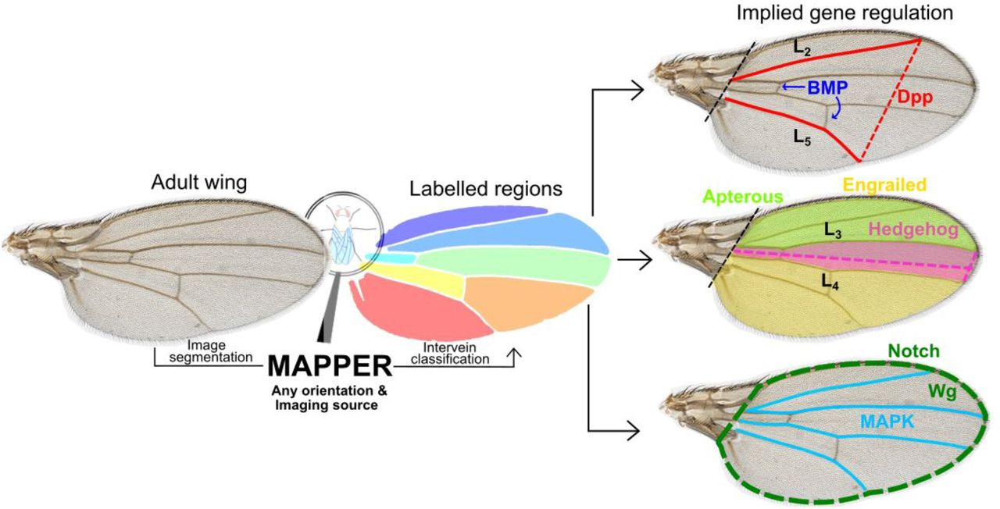

Here is a repository for the manuscript titled MAPPER: A new image analysis pipeline unmasks differential regulation of *Drosophila* wing features developed and written by Nilay Kumar and Francisco Huizar in the Zartman lab at the University of Notre Dame. The bulk of the code was built by [Nilay Kumar](https://scholar.google.com/citations?user=XZjD7PYAAAAJ&hl=en) and co-developed by [Francisco Huizar](https://www.linkedin.com/in/francisco-huizar-82bb1a127/), [Dr. Ramezan Paravi Torghabeh](https://www.linkedin.com/in/ramezan-paravi-torghabeh-phd-b432baa0/), and [Dr. Pavel Brodskiy](https://www.linkedin.com/in/pavelbrodskiy). Experimental work and validation was carried out by Nilay Kumar, [Dr. Maria Unger](https://www.linkedin.com/in/maria-unger-10523158), [Trent Robinett](https://www.linkedin.com/in/trent-robinett-5a8979161), [Keity J. Farfan-Pira](https://mx.linkedin.com/in/keity-j-farf%C3%A1n-pira-3a5a06209), and [Dharsan Soundarrajan](https://scholar.google.com/citations?user=AWv4OiIAAAAJ&hl=en). This work was done within the [Multicellular Systems Engineering Lab](http://sites.nd.edu/zartmanlab/) at the University of Notre Dame and the [Laboratory of Growth Biology and Morphogenesis](https://www.fisio.cinvestav.mx/academicos/nahmad/index.html) at the Center for Research and Advanced Studies of the National Polytechnical Institute (Cinvestav). Please direct any questions to the principal investigator, [Dr. Jeremiah Zartman](http://sites.nd.edu/zartmanlab/contacts/). 

All code was done using [Jupyter](https://jupyter.org/) notebooks where all code was run and the visible outputs are saved in the iPython notebooks. The code is available to be downloaded and run after installation of the latest version of [Jupyter](https://jupyter.org/) and [Python](https://www.python.org/).

# Instructions to run the code
- You can download all of the associated code [here](https://github.com/fjhuizar/MAPPER/archive/refs/heads/main.zip)
  - Each notebook is labeled corresponding to its associated figure in the main text of the manuscript.
- Extract the downloaded .zip folder where you would like to run the code using Jupyter
- Install all necessary Python packages using the Anaconda Prompt terminal after Jupyter and Python have been installed.
  - This is done by entering the following into the terminal:
  ```
  pip install -r /path/to/requirements.txt
  ```
  - **NOTE**: 'path/to/' should be changed to the correct path where the code was extracted to
- Use Jupyter to open each individual notebook to run the simulations

# Acknowledgements
We would like to thank the South Bend Medical Foundation for generous access to their Apero Slide Scanner. We would like to thank [Dr. Ramezan Paravi Torghabeh](https://www.linkedin.com/in/ramezan-paravi-torghabeh-phd-b432baa0/), [Vijay Kumar Naidu Velagala](https://in.linkedin.com/in/vijay-kumar-naidu-velagala-34462429), [Dr. Megan Levis](https://scholar.google.com/citations?user=SY2-XTgAAAAJ&hl=en), and [Dr. Qinfeng Wu](https://www.linkedin.com/in/qinfengwu) for technical assistance and scientific discussions related to the project. The work in this manuscript was supported in part by NIH Grant R35GM124935, NSF award CBET-1553826, NSF-Simons Pilot award through Northwestern University, the Notre Dame International Mexico Faculty Grant Program, and grant CB-014-01-236685 from the Concejo Nacional de Ciencia y Tecnología of Mexico.

# Repository last updated: July 13, 2021 8:00PM EST
